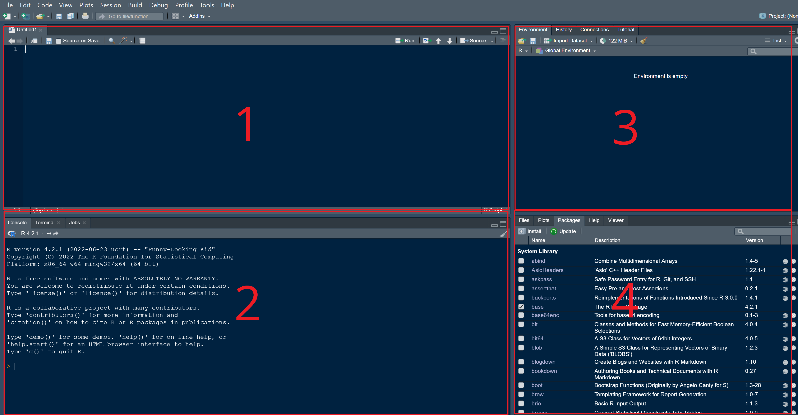

# (PART) Introduction to R {-}

# Language essentials {#chapter1}

## Why R?

R is an open-source statistical programming language used worldwide for statistical analysis and data science in a vast variety of fields. The R project was released to the public in 2000 and since then *The R Foundation* and the *R Development Core Team* take care of development of the language and of the release of new versions.^[For an interesting but a bit technical presentation of the R language see the article "R: A language for data analysis and graphics" written by two of R's main developers, Ross Ihaka and Robert Gentleman [@Ihaka].] Unlike many other computer programs for statistical and data analysis, in R you don't perform your operations by clicking. In R you work with a script, basically a text where the user write functions to perform the desired operations, such as computing averages, transforming data and so on. Although at first this seems very difficult especially for those who do not have experience with code based work, writing your own operations as if it were normal text has many advantages. This allows you not only to think carefully about the operations you are performing (rather than just clicking left and right) but also to ensure the reproducibility of your work as academic and scientific work demand. Another very good reason for using R is the large availability of R packages. R packages are collections of functions, data and other code that extend the capabilities of "base" R. Nowadays there are many R packages available to perform a wide variety of tasks, from data visualization, simple and sophisticated econometric analysis, web application development and much more. Not least, R's ability to visualize data with publication quality graphs and to write data-driven texts make it (in my opinion) an ideal choice for economists. This does not mean that R is better than other programming languages widely used in statistical analysis like Python or Julia. From what I know R is very popular among economists and for our introductory quantitative methods course R is undoubtedly the right tool to learn.

## R and RStudio

Nowadays people do not work directly in R but use what is called an Integrated Development Environment (IDE, for short). An IDE is a software that allows to work with the programming language using a user-friendly and nice interface together with several additional features that make the coding faster and more enjoyable. RStudio is by far (again, in my opinion) the best IDE for R.^[I personally have only used RStudio Desktop Open Source Edition.] It is simple to use and very intuitive. The RStudio Team has also developed a number of extremely amazing and useful packages like [rmarkdown](https://rmarkdown.rstudio.com/index.html) and [shiny](https://shiny.rstudio.com/).^[In this text we do not have time to introduce to these two great R packages. However, I highly recommend seeing what they are all about.] This book for example is written entirely in RStudio using the powerful package [bookdown](https://bookdown.org/).

We are now going to describe very briefly the interface of RStudio. As you can see from Figure \@ref(fig:imageRStudio), RStudio is composed of 4 panes.^[Note that from now on we will use the term R for simplicity but we are actually talking about using R within RStudio.]

```{r imageRStudio, echo = FALSE, fig.cap = "The four panes in RStudio."}

```

In pane 1 we can see the R script (but it could also be another file, like an R Markdown file or a Python script). This is were we will type our code. From the script we can then execute the code. The output of our code will be printed in the console. In Figure \@ref(fig:imageRStudio) the console is shown in pane 2. You can perform operations directly from the console. The result will be displayed immediately in the console itself. This can be useful on certain occasions, such as when you need to calculate something on fly that does not necessarily has to be included in your main work. In all other occasions it is recommended to write the code in the script.^[The interface of RStudio is very flexible. It can be modified easily, such as changing the order of panes or excluding some of them. So the order of the panes that you see here can be changed quite simply.] In pane 3 we can see different tabs. In the environment tab is where you will see variables, functions and databases saved during the working session. In the history tab, you will see the list of all operations performed during the working session and from there you can execute your code again. Your code is automatically stored by RStudio and saved in a separate file (although this function can be also deactivated). We omit talking about the two remaining tabs. In pane 4 we can observe different tabs again. The files tab shows basically the files contained in your computer directories, like for example your project directory if you are working with an RStudio project.^[Take a look 
[here](https://support.rstudio.com/hc/en-us/articles/200526207-Using-RStudio-Projects) to know more about RStudio projects.] From there you can create new files, rename files, delete files and so on. In the plot pane you will see your graphs printed (like scatter plots, bar charts, etc.). In the help pane as you can easily guess you can get some very useful information about R and RStudio and the R language in general and in the Viewer tab more complex things are visualized, like **plotly** graphs.^[**plotly** is an R package named after the company Plotly to produce some very cool and nice looking interactive charts. Some of the graphs in this book are made using this package.]

How to execute code?

## Basic operations

We now start by looking at some very simple operations that can be performed in R. To begin with, R can be used to solve arithmetic operations just like a normal calculator. 

```{r}
2 + 2
```

R also has standard mathematical functions such as the square root function, the exponential function and the logarithmic function. Here we go!

```{r}
sqrt(25)
```

```{r}
exp(0)
```

```{r}
log(1)
```

With a left pointing arrow (a "small than" sign followed by a minus) `<-` we can assign a value to a variable. Here for example we assign the value 15 to the variable `x`. In this case, the variable `x` is saved in the environment.

```{r}
x <- 15
```

To remove any variable from the environment, we can use the function `rm()` with the name of the variable that we wish to delete. Here, we delete the variable `x` that we have created above.

```{r}
rm(x)
```

With the function `c()` we can assign a series of value to an variable. The letter `c` stands for something like "concatenate". Using the `c()` function we have just created a vector of data that R handles as a single variable.

```{r}
x <- c(1, 2, 3)
```

With the function `ls`, we can print in the console the list of the names of the variables that we have so far created.

```{r}
ls()
```

It is a good practice to start a new working session in R with an empty environment. This short piece of code remove all variables saved in the environment so far (not many in our case!). You could put something like this at the beginning of your R script so that each time you run the script previously created variables and functions are automatically deleted. Of course, it is up to you to figure out when it is appropriate to use such a function and when not.

```{r}
rm(list = ls())
```

R can also easily creates sequences of numbers. There are two ways. The first is by using the colon operator `:`. In this case we are creating a series of integers from 1 to 10.

```{r}
a <- 1:10 
```

The second way is by using the `seq` function. With the `seq` function you can specify the beginning (`from`), the end (`to`) and the increment (`by`) of the sequence.^[If you want to know more about an R function and its arguments use the help menu in the bottom-right pane (pane 4 in Figure \@ref(fig:imageRStudio)) os simply type in the console `?` followed by the name of the function, e.g. `?seq`. This will open directely the help menu at the right page.]

```{r}
b <- seq(from = 1, to = 10, by = 1)
```

We can also generate random numbers from a normal distribution specifying mean and standard deviation (more on the normal distribution in Part II). The `set.seed` function allows us to generate the same numbers. This function is essential if we want someone else to be able to replicate the results of our simulations. This might be the case when we want to share our work with our fellow students and colleagues or with our thesis supervisor or when we want to publish a paper presenting some simulation work.

```{r}
set.seed(1234)

rnorm(n = 10, mean = 0, sd = 1)
```

A very important function in R is the `length` function. The `length` function comes in handy in a number of situations. Essentially it tells us the number of elements in a vector (but also other types of objects). We can now use the `length` function with a sequence of numbers from 1 to 10 increasing by 0.1 generated using the `seq` function. How long is this vector?

```{r}
length(seq(from = 1, to = 10, by = 0.1))
```

R also includes all the fundamental types of operators like arithmetic, relational and logical operators. Arithmetic operators are what we remember from school, like `+ - * /`. Power elevation is done with the `^` sign.^[There are other mathematical operators in R, such as for matrix multiplication `%*%`. We do not discuss this at the moment.]

```{r}
5^2
```

Relational operators are used to compare values. They are kind of making a question to R where the response will be a "true or false" judgement.

```{r}
100 >= 100
```

```{r}
99 > 100
```

With the double equal operator `==` we are asking R if two expressions are equal to each other.^[Be careful when using the double equal operator because the single equal sign `=` in R can be used as an assignment operator, e.g. `x = 5`. This is why I recommend using the assignment operator `<-` rather than `=`.]

```{r}
2 + 2 == 4
```

The operator `!` is the negation operator in R. It can be read as **NOT**. With the following expression we are asking R if 99 is **NOT** equal to 100.

```{r}
99 != 100
```

Here, we are asking if 1 is **NOT** equal to 1.

```{r}
!(1==1) 
```

In R we also find the classical logical operators, like `&` and `|`. The operator `|` ask if at least one of the two expressions is true. The operator `|` can be read as **OR**. The following expression asks if 1 is equal to 1 **OR** 2 is equal to 3. It will return true if at least one of the expressions is true.

```{r}
(1==1) | (2==3) 
```

The operator `&` (read **AND**) returns true when both expressions are true. The following expression asks if 1 is equal to 1 *AND* 2 is equal to 3.

```{r}
(1==1) & (2==3)  
```

Before concluding this section we want to briefly discuss what in R is called the **recycling rule**. This could help avoiding some bad surprises when working in R. 

## Basic data structures

We now move to discuss the basic data structures in R. Vector, Matrix, Dataframe, List

## If conditions

## For loops

compounding interest

```{r}

data_interests <- numeric(100)

interests <- 0.01

data_interests[1] <- 1

for (t in 2:length(data_interests)) {
    
    data_interests[t] <- data_interests[t-1] * (1 + interests)
  
}

```

```{r}

plot(x = 1:100,
     y = data_interests,
     xlim = c(1, length(data_interests)), 
     ylim = c(1, max(data_interests)),
     type = "l", 
     col = "black",
     main = "Investments", 
     xlab = "Year", 
     ylab = "Euro")

```

## Nested loops

With the ability to nest loops within other loops things start to get interesting. Here for example we can expand the previous example with alternative scenarios regarding the interest rate using a very simple nested loop. The first for loop deals with repetitions over time, just as in the previous example. The second for loop, on the other hand, allows us to simulate different scenarios with different assumptions about the interest rate

```{r}

data_interests <- matrix(nrow = 100, ncol = 3, byrow = TRUE)

interests <- c(0.01, 0.02, 0.03) 

data_interests[1,1] <- 1
data_interests[1,2] <- 1
data_interests[1,3] <- 1

for (t in 2:nrow(data_interests)) {
  
  for (s in 1:ncol(data_interests)) {
    
    data_interests[t,s] <- data_interests[t-1,s] * (1 + interests[s])
    
  }
  
}

```

To make thins more interesting we can use a loop (a simple one, no need for a nested loop here) to simply the code for our plot. 

What would be the alternative? The alternative would be to repeat the `lines` function three times, each time using the desired scenario as input, e.g. `data_interests[,1]`. Note that the color will also depend on the index and therefore on the scenario (`col = l`) as we want a different color for each scenario.

```{r}

plot(NULL, 
     xlim = c(1, nrow(data_interests)), 
     ylim = c(1, max(data_interests)),
     main = "Investments", 
     xlab = "Year", 
     ylab = "Euro")

for (l in 1:ncol(data_interests)) {
lines(data_interests[,l], type = "l", col = l)
}

```

## Simple functions

## The apply family

The apply "family" of functions.


We have already reached the end of the first chapter. I hope you are not bored. In the next chapter, we will take a closer look at how to work with data in a dataframe, such as how to edit data, select variables, create new ones and much more.


