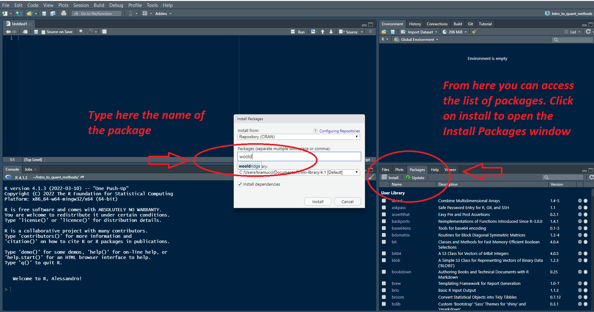
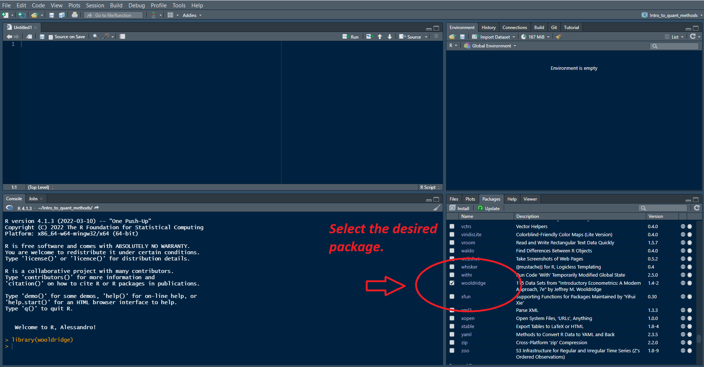

# Data extraction and manipulation {#chapter2}

In this chapter, we want to learn how to use R, and in particular the functions of what is also called "base R" to work with data^[So we do not use any additional functions from packages like *dplyr*]. To practice we will use a dataset contained in the package *wooldridge*. This R package contains all the databases used in the famous econometrics textbook *Introductory Econometrics: A Modern Approach* by Jeffrey M. @wool. All information on the datasets available in the package, such as variable names, data sources, etc., can be found in the related [R package documentation](https://cran.r-project.org/web/packages/wooldridge/wooldridge.pdf). We start by installing the desired package.

```{r,  echo = TRUE, eval = FALSE}
install.packages("wooldridge")
```

After having installed the package, we must load it into the library.

```{r, echo = TRUE}
library(wooldridge)
```

To unload the package from the library, we can use the following code. We don't need this now. We want to continue using the package, of course!

```{r, echo = TRUE, eval = FALSE}
detach("package:wooldridge", unload = TRUE)
```

In RStudio this procedure is even easier. To install a package, simply select the desired package from the drop-down menu, which is accessed from the `Packages` tab in the panel that is (usually) located in the bottom right-hand corner. This (very simple) procedure is summarised in figure \@ref(fig:image1).

```{r image1, fig.cap = "How to install a package in RStudio."}

```

Once the package is installed, we have to load it into the library. In this case, we simply check the box of the desired package just as shown in figure \@ref(fig:image2).

```{r image2, fig.cap = "Load the package to the library from RStudio."}

```

R is different from Excel in several respects. One in particular is clear. With Excel, one works mainly by looking at the data. In R, on the other hand, one works mainly by looking at the codes. However, it is necessary to look at the data from time to time, for example after having modified existing variables or having created new ones. The dataset we use in this exercise is called *wage1*. We can take a glance at the data using the *View* function.

```{r, echo = TRUE, eval = FALSE}
View(wage1)
```

Let us start by seeing how many columns and rows our dataset contains.

```{r}
dim(wage1)
```

Indexing when you need to address a particular element into a vector, for example the wage of worker nr. 5

```{r}
wage1$educ[5]
```

If we want data for more than one worker

```{r}
#wage1$educ[c(2,3,5)]
```

Data from worker one to worker five

```{r}
#wage1$educ[1:5]
```

If we want to modify one particular observation

```{r}
#wage1$educ[5] <- NA
```

Negative indexing allow to show all data except those specified in parenthesis

```{r}
#wage1$educ[-c(1:520)]
```

Negative indexing allow us to drop specified rows and columns. Drop the first row in the dataset

```{r}
#wage1[-1,]
```

Sometimes we may have to delete some variables from our dataset. To delete a column, we must use the negative sign in front of the variable that we wish to delete. In this case, we are eliminating the first column,

```{r}
#wage1[,-1]
```

We can also delete columns using variable names. In this case, we delete the variable containing the years of education (which is the first variable in the dataset).

```{r}
#wage1[2]
```


Converting dollars to euros and add the new column variable to the dataset.

```{r}
wage1$wage_EUR <- wage1$wage * 0.86
```

We can compare the variable wage, originally expressed in dollars, and the new variable `wage_EUR`. Here we take a look at the first five rows.

```{r}
wage1[1:5, c("wage", "wage_EUR")]
```

## Conditional selection

To use when you need to extract some data that satisfy certain criteria Workers that have more than 15 years of education

Workers that have between 15 AND 18 year of education

Workers that have between 15 OR 18 year of education

A more interesting research question is to ask the hourly wage of workers that have 15 or more years of education

Hourly wage of workers with more than 15 years of education and 5 years of experience 

Look at what happens when we type educ>15. We can exploit the fact that TRUE=1 and FALSE=0 to calculate the percentage of workers that have more than 15 years of education

```{r, echo = TRUE, eval = FALSE}
wage1$educ[wage1$educ > 17]
```

```{r, echo = TRUE, eval = FALSE}
wage1$educ[wage1$educ >= 15 & wage1$educ <= 18]
```

```{r, echo = TRUE, eval = FALSE}
wage1$educ[wage1$educ >= 17 | wage1$educ <= 2]
```

```{r, echo = TRUE, eval = FALSE}
wage1$wage[wage1$educ >= 15]
```

```{r, echo = TRUE, eval = FALSE}
wage1$wage[wage1$educ >= 15 & wage1$exper >= 5]
```

```{r, echo = TRUE, eval = FALSE}
sum(wage1$educ > 15) / sum(wage1$educ >= 0) * 100

```

